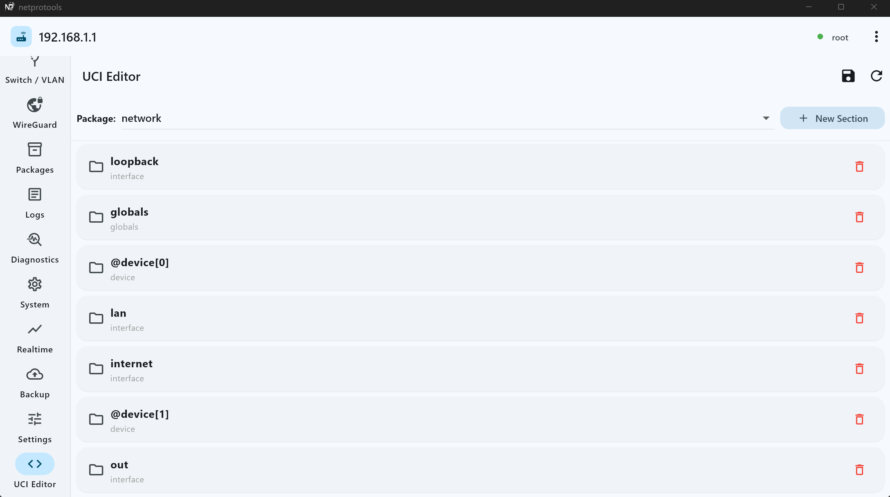
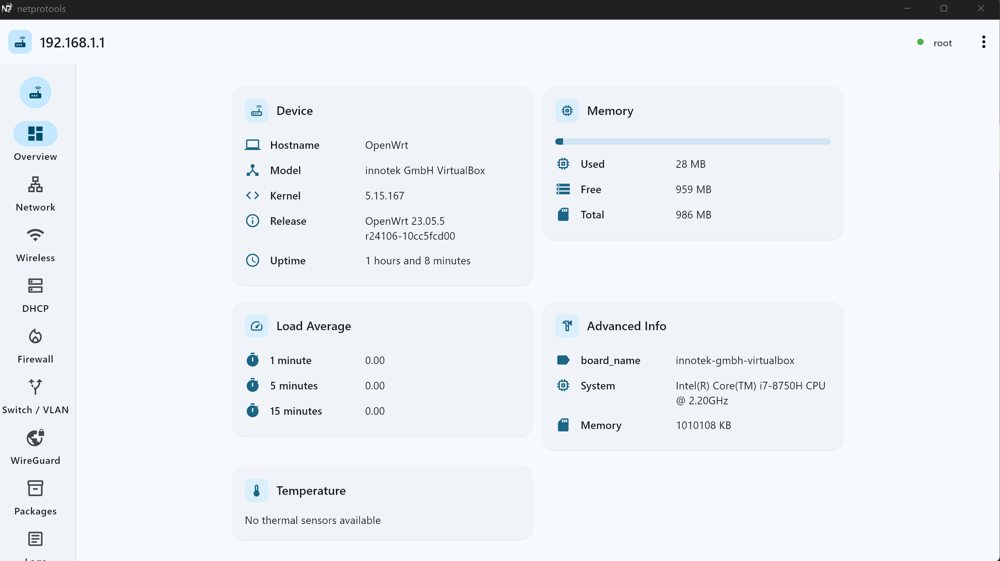
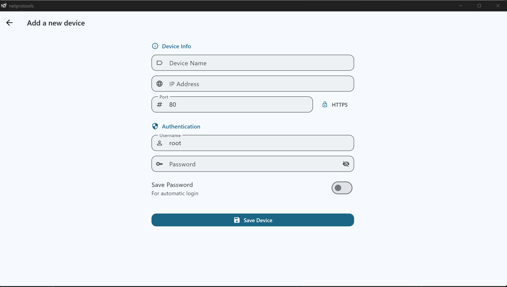
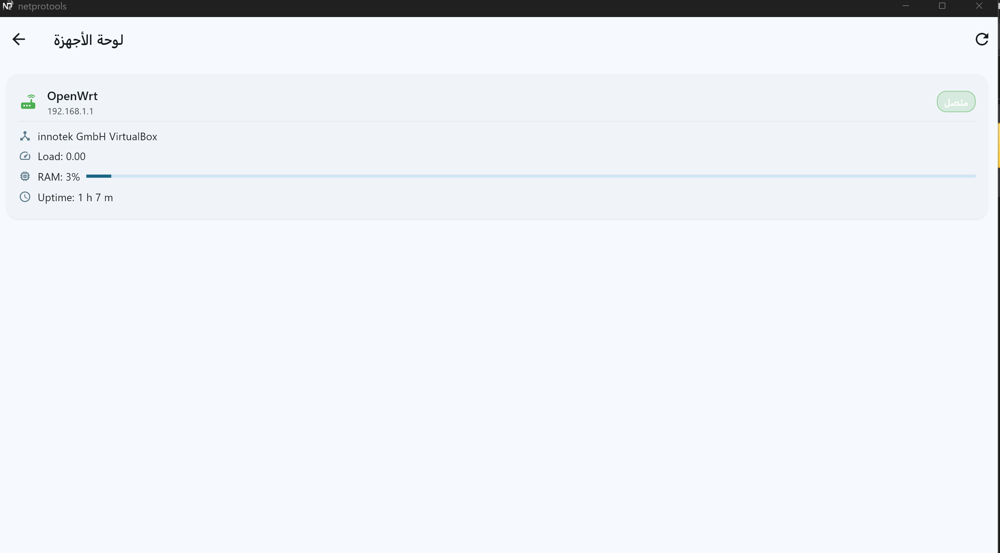
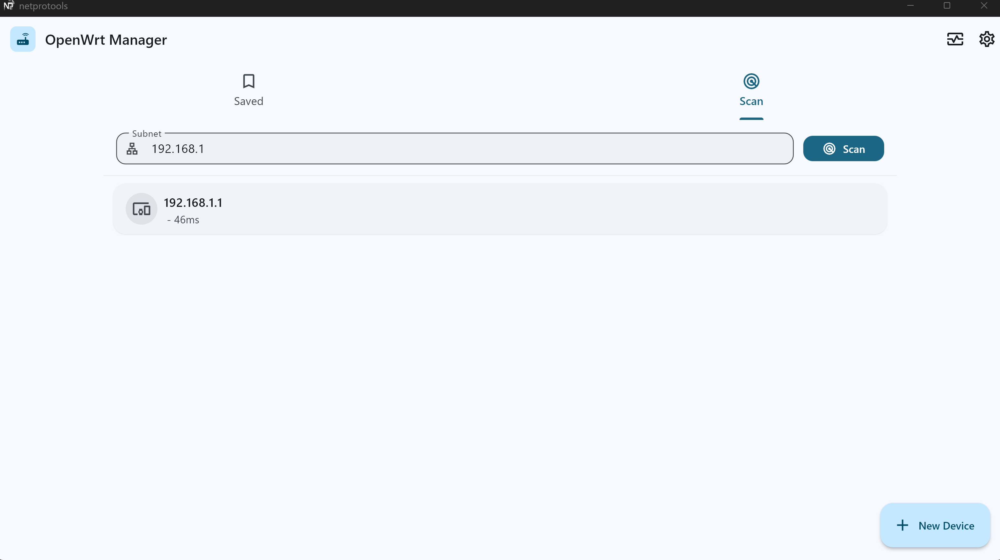
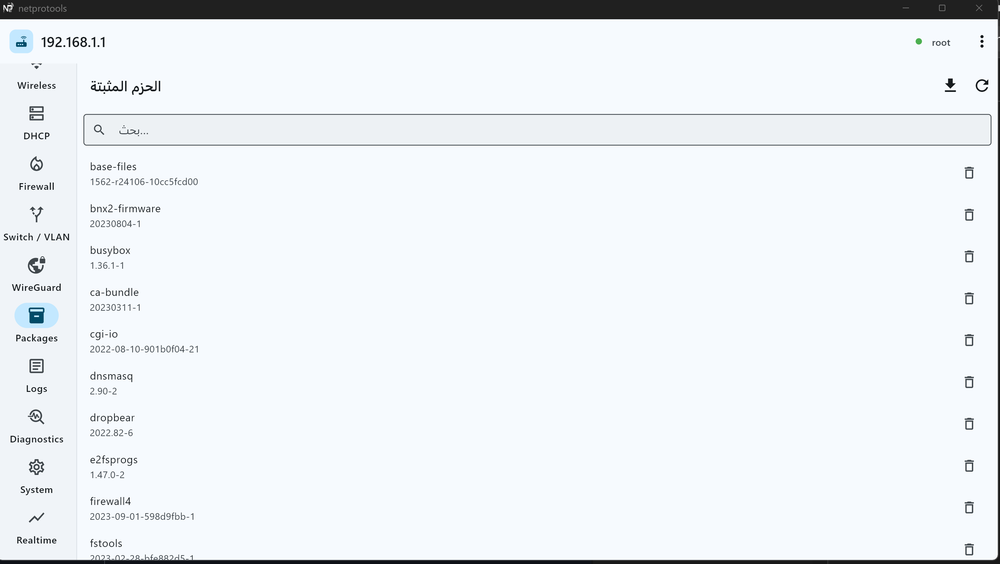

# NetProTools

NetProTools is a professional OpenWrt router management application built with Flutter.  
It provides a modern, fast, and secure interface for managing network devices across Android and Windows platforms.

---

## 📌 Overview

This project focuses on simplifying router and network management through a clean and intuitive interface.  
It is designed for network engineers and advanced users who need powerful tools in a structured UI.

---

## 🚀 Key Features

- Router management dashboard
- Network diagnostics (Ping / Traceroute)
- Firewall and VLAN configuration
- Wireless network control
- Package management (opkg support)
- System monitoring and logs
- Guided configuration wizards
- Secure SSH & ubus command handling
- Cross-platform support (Android / Windows)

---

## 🧠 Architecture

The application is built using a **feature-first Clean Architecture** approach to ensure scalability and maintainability.

- Presentation layer for UI and state management
- Domain layer for business logic
- Data layer for external communication
- Core layer for shared services and utilities

---

## ⚙️ System Design Highlights

- Centralized command execution engine (CommandBridge)
- Dual transport system (ubus + SSH fallback)
- Circuit breaker protection for unstable connections
- Wizard-based configuration system
- Atomic configuration execution with rollback support

---

## 🧩 Configuration Modes

The application supports environment-based configuration:

- Development mode: Debug tools and extended logging
- Production mode: Optimized performance and minimal logs

---

## 📱 Platforms

- Android
- Windows Desktop

---

## 📦 Release Strategy

This project is distributed through **Microsoft Store** for Windows users.  
Android builds are used for internal testing and controlled distribution.

Each release is versioned and documented externally.

---
## 📥 Download

Available on Microsoft Store:  
[https://apps.microsoft.com/store/apps/your-app-id](https://apps.microsoft.com/detail/9nxgtk6p3zgq?hl=en-us&gl=US&ocid=pdpshare)
---

## 🔒 Source Code Policy

The source code of this project is **not publicly available**.  
This repository serves as:

- Project showcase
- Release documentation
- Version tracking
- Public portfolio entry

---

## 📷 Screenshots

### Dashboard

### Network add

### status

### packages

---

## 📄 License

Private project – All rights reserved.
